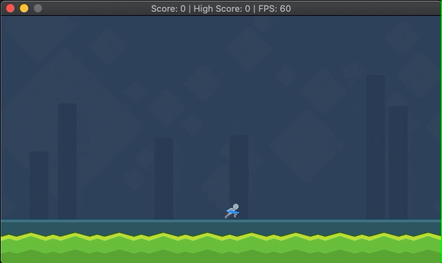

# CPPND: Capstone Action Game

This is a Capstone project for the [Udacity C++ Nanodegree Program](https://www.udacity.com/course/c-plus-plus-nanodegree--nd213). The code for this project was forked from the  The code for this repo was forked from [this repo](https://github.com/udacity/CppND-Capstone-Snake-Game).

## Preview

## How to Play
Move forward in the level destroying as many enemies as you can without getting hit to achieve a high score.

## Controls

1. Left arrow or A moves left
2. Right arrow or D moved right
3. Up arrow or W jump
4. Spacebar to attack

## Dependencies for Running Locally

* cmake >= 3.7
  * All OSes: [click here for installation instructions](https://cmake.org/install/)
* make >= 4.1 (Linux, Mac), 3.81 (Windows)
  * Linux: make is installed by default on most Linux distros
  * Mac: [install Xcode command line tools to get make](https://developer.apple.com/xcode/features/)
  * Windows: [Click here for installation instructions](http://gnuwin32.sourceforge.net/packages/make.htm)
* SDL2 >= 2.0 
  * All installation instructions can be found [here](https://wiki.libsdl.org/Installation)
  >Note that for Linux, an `apt` or `apt-get` installation is preferred to building from source. 
* SDL_image >= 2.0
  * `apt-get install libsdl2-image-dev`
* gcc/g++ >= 5.4
  * Linux: gcc / g++ is installed by default on most Linux distros
  * Mac: same deal as make - [install Xcode command line tools](https://developer.apple.com/xcode/features/)
  * Windows: recommend using [MinGW](http://www.mingw.org/)

## Basic Build Instructions

1. Clone this repo.
2. Make a build directory in the top level directory: `mkdir build && cd build`
3. Compile: `cmake .. && make`
4. Run it: `./ActionGame`

## File Structure
`/assets`: images and other assets loaded into the game
`/src`: stores all source files

 ## Important Classes
 `GameTexture` was created to handle the loading and unloading of texture files for the project.
 `SpritesheetTexture` and `ScrollingTexture` are children of `GameTexture` with added functionality for rendering and animating.

 ## Rubric Criteria Met
 | Criteria | Description |
 | -------- | ----------- |
 | **The project demonstrates an understanding of C++ functions and control structures.** | For and while loops are used in various areas, including the Game::Update() method |
 | **The project reads data from a file and process the data, or the program writes data to a file.** | GameTexture::CreateFromFile() method loads images into textures in memory |
 | **The project accepts user input and processes the input.** | Controller::HandleInput() handles user input from the keyboard |
 | **The project uses Object Oriented Programming techniques.** | ScrollingTexture and SpritesheetTexture inherit from GameTexture |
 | **Classes use appropriate access specifiers for class members** | Each class has appropriate access specifiers utilized |
 | **Class constructors utilize member initialization lists.** | Game class utilizes member initialzation lists |
 | **Classes encapsulate behavior.** | Player class encapsulates specific player behavior. GameTexture handles loading and storing of textures |
 | **Classes follow an appropriate inheritance hierarchy.** | See GameTexture and Spritesheet Texture |
 | **Overloaded functions allow the same function to operate on different parameters.** | Enemy.h line 17 and 18 display this |
 | **The project uses destructors appropriately.** | Destructors are used in GameTexture, Player and Enemy classes |
 | **The project uses move semantics to move data, instead of copying it, where possible.** | renderer.cpp moves ownership of the GameTexture pointers to the Player in lines 69-79 |

## CC Attribution-ShareAlike 4.0 International

Shield: [![CC BY-SA 4.0][cc-by-sa-shield]][cc-by-sa]

This work is licensed under a
[Creative Commons Attribution-ShareAlike 4.0 International License][cc-by-sa].

[![CC BY-SA 4.0][cc-by-sa-image]][cc-by-sa]

[cc-by-sa]: http://creativecommons.org/licenses/by-sa/4.0/
[cc-by-sa-image]: https://licensebuttons.net/l/by-sa/4.0/88x31.png
[cc-by-sa-shield]: https://img.shields.io/badge/License-CC%20BY--SA%204.0-lightgrey.svg
